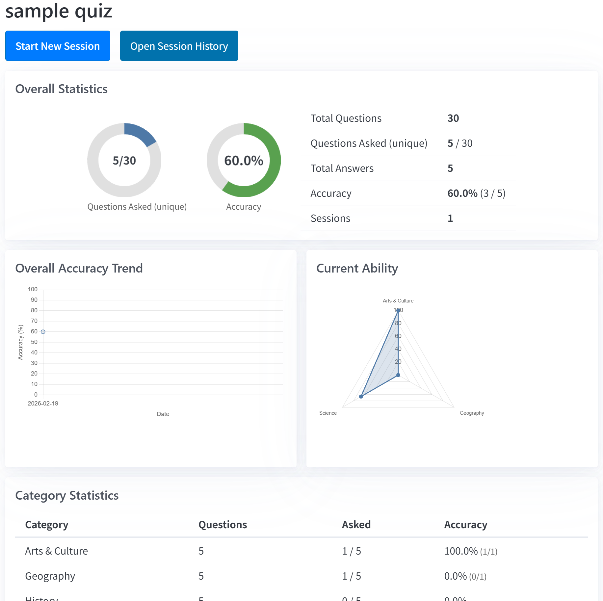
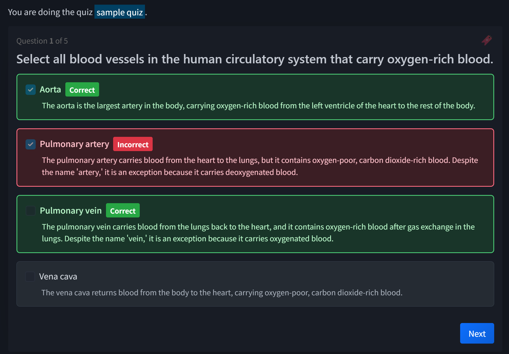
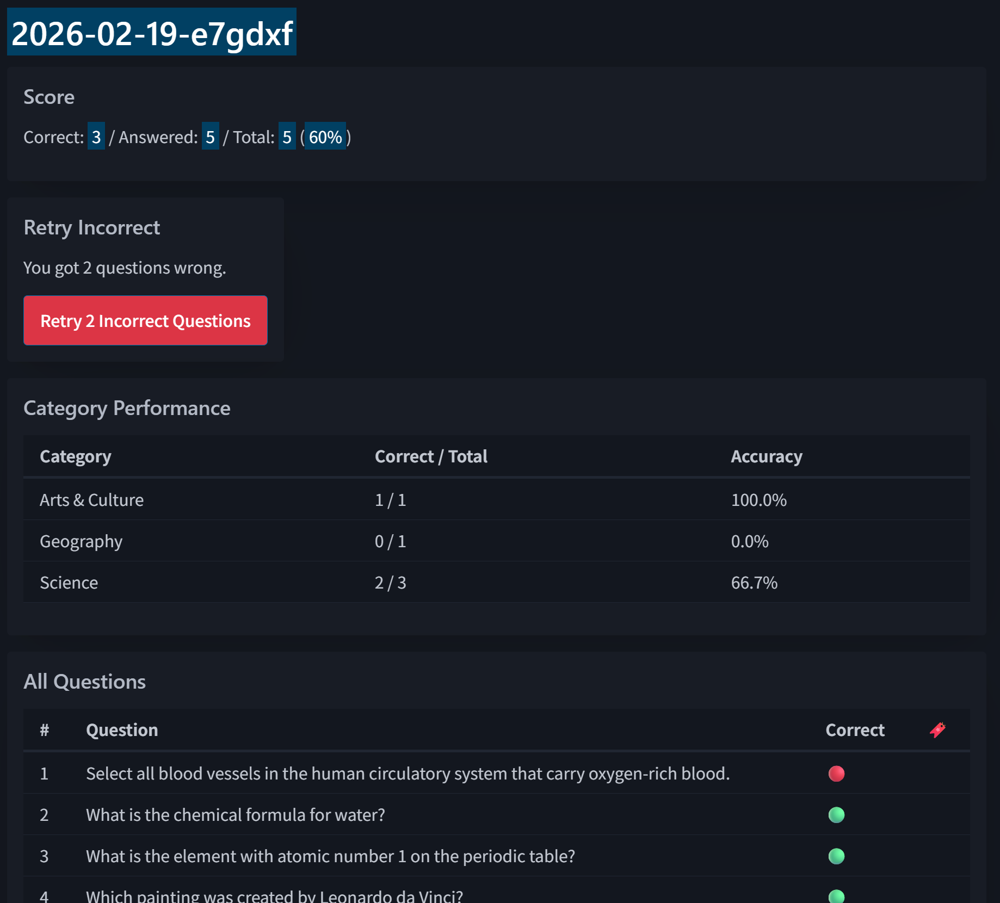
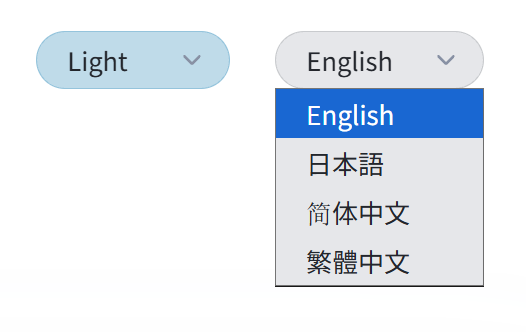

# Quizinart

[日本語](README_ja.md)

A self-hosted, learning-focused quiz application. Built with Rust, HTMX, and libSQL.

Forked from [frectonz/quizzy](https://github.com/frectonz/quizzy) and extended with features for effective study.

## Screenshots

| Dashboard | Quiz | Results |
|-----------|------|---------|
|  |  |  |

Light/Dark theme and multi-language support (English, Japanese, Simplified Chinese, Traditional Chinese):



## Features

- **Smart question selection** — choose from unanswered, previously incorrect, or random questions
- **Session resume** — pick up where you left off by name, across devices
- **Per-option explanations** — every answer choice can have a detailed explanation
- **Category statistics** — track accuracy by category on the dashboard
- **Retry incorrect** — instantly create a new session from missed questions
- **Multi-device** — responsive UI works on desktop and mobile
- **No account required** — just enter a name to start

## Tech Stack

| Layer | Technology |
|-------|-----------|
| Backend | Rust, Warp, Maud |
| Frontend | HTMX, PicoCSS |
| Database | libSQL (SQLite-compatible, Turso for remote) |

## Quick Start

### Prerequisites (Windows)

Run in an **administrator** terminal:

```powershell
# Rust toolchain
winget install Rustlang.Rustup

# C++ build tools (required by Rust linker)
winget install Microsoft.VisualStudio.2022.BuildTools --override "--wait --passive --add Microsoft.VisualStudio.Workload.VCTools --includeRecommended"
```

After installation, open a new terminal and verify:

```powershell
rustup --version
cargo --version
```

To run E2E tests, you also need Node.js:

```powershell
winget install Volta.Volta
volta install node
```

### Prerequisites (WSL / Linux)

For development on WSL Ubuntu:

```bash
# Rust toolchain
curl --proto '=https' --tlsv1.2 -sSf https://sh.rustup.rs | sh
source "$HOME/.cargo/env"

# C compiler & build tools (required by libsql-ffi)
sudo apt update && sudo apt install -y build-essential pkg-config libssl-dev
```

Verify:

```bash
rustup --version
cargo --version
```

To run E2E tests, you also need Node.js and Playwright:

```bash
# Node.js
curl -fsSL https://deb.nodesource.com/setup_22.x | sudo -E bash -
sudo apt install -y nodejs

# Playwright browsers (run in the project directory)
npx playwright install --with-deps chromium
```

### Run locally

```bash
# Copy the env sample and edit if needed
cp .env.example .env

# Start (reads .env automatically)
cargo run --manifest-path quizinart/Cargo.toml
```

The `.env.example` file contains sensible defaults for local development (SQLite file DB, port 1414).

Open http://127.0.0.1:1414 in your browser.

### First-time setup

1. Set an admin password on first visit
2. Click **Create Quiz**, name it, and upload a quiz JSON file
3. Go to the quiz page, enter your name, and start

## Sample Quiz

Sample general education quiz files (30 questions each, 6 categories) are included in the `samples/` directory:

| File | Language |
|------|----------|
| `samples/general-education-en.json` | English |
| `samples/general-education-ja.json` | 日本語 |
| `samples/general-education-zh-CN.json` | 简体中文 |
| `samples/general-education-zh-TW.json` | 繁體中文 |

After setting up your admin password, click **Create Quiz**, give it a name, and upload one of these files to try it out.

## Quiz JSON Format

Questions are imported from a single JSON file. Each question has a text, category, answer options with optional explanations, and a multiple-choice flag:

```json
[
  {
    "question": "What is the capital of France?",
    "category": "Geography",
    "isMultipleChoice": false,
    "options": [
      { "text": "Berlin", "isAnswer": false, "explanation": "Berlin is the capital of Germany." },
      { "text": "Paris", "isAnswer": true, "explanation": "Paris has been the capital of France since the 10th century." },
      { "text": "Madrid", "isAnswer": false, "explanation": "Madrid is the capital of Spain." }
    ]
  }
]
```

## Project Structure

```
quizinart/
├── src/
│   ├── main.rs                # Entry point, routes, auth
│   ├── db/                    # Database layer
│   │   ├── schema.rs          # Table definitions
│   │   ├── session.rs         # Session CRUD
│   │   ├── question.rs        # Questions & stats
│   │   ├── answer.rs          # Answer recording
│   │   ├── admin.rs           # Admin auth
│   │   ├── quiz.rs            # Quiz management
│   │   └── report.rs          # Reporting
│   ├── handlers/              # HTTP handlers
│   │   ├── quiz.rs            # Quiz flow logic
│   │   └── homepage.rs        # Landing page
│   ├── views/                 # Maud HTML templates
│   │   ├── layout.rs          # Page shell
│   │   ├── quiz.rs            # Quiz views
│   │   └── homepage.rs        # Home views
│   ├── names.rs               # Route & cookie constants
│   ├── utils.rs               # Helpers
│   └── statics.rs             # Static file serving
├── samples/                   # Sample quiz JSON files
├── static/                    # CSS, JS, images
└── Cargo.toml
```

## License

MIT

## Credits

- Quiz engine based on [Quizzy](https://github.com/frectonz/quizzy) by frectonz
- Built with Claude Code
